```mermaid
graph LR
    A[Onboarding Signals] --> B{Persona Classifier}
    B --> C["Primary: storm-chaser 🌨️<br/>Confidence: 0.87"]
    B --> D["Secondary: budget-maximizer 💰"]
    C --> E["Legacy mapping: destination-traveler"]
```

```mermaid
graph LR
    A[Onboarding Signals] --> B{Persona Classifier}
    B --> C["Primary: core-local 🎿<br/>Confidence: 0.95"]
    B --> D["Secondary: storm-chaser 🌨️"]
    C --> E["Legacy mapping: powder-hunter"]
```

```mermaid
graph LR
    A[Onboarding Signals] --> B{Persona Classifier}
    B --> C["Primary: family-planner 👨‍👩‍👧<br/>Confidence: 0.92"]
    B --> D["Secondary: weekend-warrior ⏰"]
    C --> E["Legacy mapping: family-planner"]
```

# Alert Tab User Flows — 3 Personas

Three real-world user flows showing how alerts are generated, personalized, and delivered based on onboarding data, location, and ski behavior.

---

## User Flow 1: Sarah — Sacramento, CA (Storm Chaser)

### Onboarding Data

| Field | Value |
|-------|-------|
| **Name** | Sarah |
| **Location** | Sacramento, CA |
| **Pass Type** | Ikon |
| **Drive Radius** | 180 min (3 hours) |
| **Ski Frequency** | Regular (6-15 days) |
| **Group Type** | Partner |
| **Chase Willingness** | Yes — anywhere |
| **Decision Triggers** | Fresh snow, Good deal |
| **Experience Level** | Advanced |

### Persona Classification

```
Signals → Classifier:
  frequency: "regular"
  groupType: "partner"
  decisionTriggers: ["snow", "deal"]
  experienceLevel: "advanced"
  chase: "anywhere"
```



**Result:**
- **Primary Persona:** `storm-chaser` 🌨️ (confidence: 0.87)
- **Secondary Persona:** `budget-maximizer` 💰
- **Legacy Persona:** `destination-traveler`
- **Notification Style:** Storm alerts with travel options, deal-focused

### Stored Preferences

```json
{
  "location": "Sacramento, CA",
  "passType": "ikon",
  "driveRadius": 180,
  "chaseWillingness": "anywhere",
  "persona": "destination-traveler",
  "userPersona": {
    "primary": "storm-chaser",
    "secondary": "budget-maximizer",
    "confidence": 0.87,
    "signals": {
      "frequency": "regular",
      "groupType": "partner",
      "decisionTriggers": ["snow", "deal"],
      "experienceLevel": "advanced"
    }
  },
  "onboardingComplete": true
}
```

### Resorts Within Reach (3-hour drive from Sacramento)

| Resort | Pass | Drive | Elevation | Annual Snow |
|--------|------|-------|-----------|-------------|
| Palisades Tahoe | **Ikon** | 1h 50m | 9,006 ft | 400" |
| Sierra-at-Tahoe | **Ikon** | 1h 40m | 8,852 ft | 400" |
| Boreal Mountain | Independent | 1h 45m | 7,700 ft | 400" |
| Northstar | Epic | 2h 00m | 8,610 ft | 350" |
| Heavenly | Epic | 2h 15m | 10,067 ft | 360" |
| Kirkwood | Epic | 2h 30m | 9,800 ft | 354" |

**On Sarah's Ikon pass:** Palisades Tahoe, Sierra-at-Tahoe

**Chase destinations (national):** Mammoth Mountain (Ikon), Steamboat (Ikon), Jackson Hole (Ikon), Aspen (Ikon)

### Alert Generation Flow


### Sarah's Alert Timeline

| Date | Time | Alert Type | Urgency | Title | Body |
|------|------|-----------|---------|-------|------|
| Feb 10 | 10:00 AM | Chase Alert (Heads Up) | alert | Mammoth: 24-36" possible next week | Models showing atmospheric river targeting Sierra Nevada. On your Ikon pass. Keep an eye on this. |
| Feb 11 | 8:00 AM | Chase Alert (Firming Up) | alert | Mammoth: 30-40" firming up 🎯 | On your Ikon pass. SMF→MMH $189 RT. Book today if you want to chase this. Forecast confidence now 80%. |
| Feb 11 | 3:15 PM | Price Drop | alert | MMH flights dropped to $189 ✈️ | Was $229 yesterday. 4 seats left on Thursday morning flight. Storm window: Thu PM → Sat AM. |
| **Feb 12** | **6:30 AM** | **Powder Alert** | **critical** | **Palisades got 8" overnight ❄️** | **KT-22 and Granite Chief are loaded. Leave by 5:30 AM — lot fills by 7:30. On your Ikon pass. Best day this month.** |
| Feb 13 | 8:00 AM | Chase Alert (Book Now) | critical | 🔴 Mammoth hit 28" and counting | Storm continues through Friday. SMF→MMH still $189. Last 2 seats. This is a once-a-season event. |
| Feb 13 | 6:00 PM | Weekend Outlook | info | This weekend: Palisades Tahoe 🟡 | 16" new this week. All terrain open. Sierra-at-Tahoe also got 12". Both on your Ikon pass — pick your favorite. |

**Key personalization:**
- Chase alerts escalate (📡 → 🎯 → 🔴) because `chase_willingness: "anywhere"`
- Flight prices included because `decisionTriggers` includes `"deal"`
- Mammoth flagged despite being outside 3-hour drive (chase destination, Ikon pass)
- Local powder alert for Palisades (within drive radius, on pass)
- Max 2 alerts per day enforced (Feb 11 has 2: chase + price drop)

---

## User Flow 2: Jake — Denver, CO (Core Local)

### Onboarding Data

| Field | Value |
|-------|-------|
| **Name** | Jake |
| **Location** | Denver, CO |
| **Pass Type** | Epic |
| **Drive Radius** | 120 min (2 hours) |
| **Ski Frequency** | Core (30+ days) |
| **Group Type** | Solo |
| **Chase Willingness** | Within driving distance |
| **Decision Triggers** | Fresh snow |
| **Experience Level** | Expert |

### Persona Classification

```
Signals → Classifier:
  frequency: "core"
  groupType: "solo"
  decisionTriggers: ["snow"]
  experienceLevel: "expert"
  chase: "driving"
```



**Result:**
- **Primary Persona:** `core-local` 🎿 (confidence: 0.95)
- **Secondary Persona:** `storm-chaser` 🌨️
- **Legacy Persona:** `powder-hunter`
- **Notification Style:** High frequency, early morning alerts, real-time conditions

### Stored Preferences

```json
{
  "location": "Denver, CO",
  "passType": "epic",
  "driveRadius": 120,
  "chaseWillingness": "driving",
  "persona": "powder-hunter",
  "userPersona": {
    "primary": "core-local",
    "secondary": "storm-chaser",
    "confidence": 0.95,
    "signals": {
      "frequency": "core",
      "groupType": "solo",
      "decisionTriggers": ["snow"],
      "experienceLevel": "expert"
    }
  },
  "onboardingComplete": true
}
```

### Resorts Within Reach (2-hour drive from Denver)

| Resort | Pass | Drive | Elevation | Annual Snow |
|--------|------|-------|-----------|-------------|
| Loveland | Independent | 1h 15m | 13,010 ft | 400" |
| Arapahoe Basin | **Ikon** | 1h 25m | 13,050 ft | 300" |
| Keystone | **Epic** | 1h 30m | 12,408 ft | 235" |
| Breckenridge | **Epic** | 1h 30m | 12,998 ft | 300" |
| Copper Mountain | Ikon | 1h 25m | 12,313 ft | 305" |
| Vail | **Epic** | 1h 40m | 11,570 ft | 350" |
| Beaver Creek | **Epic** | 1h 50m | 11,440 ft | 325" |
| Ski Cooper | Independent | 1h 50m | 11,700 ft | 260" |
| Winter Park | Ikon | 1h 30m | 12,060 ft | 325" |
| Eldora | Ikon | 50m | 10,800 ft | 300" |

**On Jake's Epic pass:** Keystone, Breckenridge, Vail, Beaver Creek

**Driving chase range (within ~5-6 hours):** Crested Butte (Epic), Telluride (Epic), Steamboat (Ikon), Aspen (Ikon)

### Alert Generation Flow


### Jake's Alert Timeline

| Date | Time | Alert Type | Urgency | Title | Body |
|------|------|-----------|---------|-------|------|
| Feb 18 | 10:00 AM | Storm Incoming | alert | 12-18" hitting Breck/Keystone Tue-Wed 🌨️ | NWS Winter Storm Watch for I-70 Corridor. Upslope flow favors Summit County. Best day: Thursday Feb 20. Both on your Epic pass. |
| Feb 19 | 6:30 AM | Worth Knowing | info | Loveland got 9" — 2x Keystone 💡 | Not on your Epic pass, but $89 walk-up and 15 min closer from Denver. Best snow on I-70 right now. |
| **Feb 20** | **5:30 AM** | **Powder Alert** | **critical** | **Breck got 14" overnight ❄️** | **Imperial Chair and Peak 6 are loaded. Leave by 5:00 AM — I-70 clear past Georgetown. Best powder day this season. On your Epic pass.** |
| Feb 21 | 5:30 AM | Powder Alert | critical | Bluebird + 16" at Breck 🔵❄️ | Storm cleared overnight. Back Bowls groomed + untracked. Peak 8 trees still holding stashes. No wind holds. Perfect dawn patrol day. |

**Key personalization:**
- Powder alerts sent at **5:30 AM** (core-local dawn patrol schedule, not 6:30 AM)
- Terrain-specific details (Imperial Chair, Peak 6, Back Bowls) for expert rider
- I-70 road conditions included (Denver local concern)
- Worth Knowing surfaces Loveland despite not being on Epic pass
- No chase flights — `chase_willingness: "driving"` so only driving destinations
- No weekend outlook — core-local skis any day, gets "Best Day" alerts instead
- Single trigger `["snow"]` means alerts focus purely on snowfall, no deals/prices

---

## User Flow 3: Maria — Scranton, PA (Family Planner)

### Onboarding Data

| Field | Value |
|-------|-------|
| **Name** | Maria |
| **Location** | Scranton, PA |
| **Pass Type** | Epic |
| **Drive Radius** | 120 min (2 hours) |
| **Ski Frequency** | Casual (0-5 days) |
| **Group Type** | Family with kids |
| **Child Ages** | 5-10, 11-15 |
| **Chase Willingness** | No |
| **Decision Triggers** | Weekend free, Trip planned |
| **Experience Level** | Intermediate |

### Persona Classification

```
Signals → Classifier:
  frequency: "casual"
  groupType: "family"
  decisionTriggers: ["time", "planned"]
  experienceLevel: "intermediate"
  childAges: [5-10, 11-15]
  chase: "no"
```



**Result:**
- **Primary Persona:** `family-planner` 👨‍👩‍👧 (confidence: 0.92)
- **Secondary Persona:** `weekend-warrior` ⏰
- **Legacy Persona:** `family-planner`
- **Notification Style:** Weekend-focused, family-friendly, low frequency

### Stored Preferences

```json
{
  "location": "Scranton, PA",
  "passType": "epic",
  "driveRadius": 120,
  "chaseWillingness": "no",
  "persona": "family-planner",
  "userPersona": {
    "primary": "family-planner",
    "secondary": "weekend-warrior",
    "confidence": 0.92,
    "signals": {
      "frequency": "casual",
      "groupType": "family",
      "decisionTriggers": ["time", "planned"],
      "experienceLevel": "intermediate",
      "childAges": [7, 13]
    }
  },
  "onboardingComplete": true
}
```

### Resorts Within Reach (2-hour drive from Scranton)

| Resort | Pass | Drive | Elevation | Night Skiing | Snowmaking |
|--------|------|-------|-----------|-------------|------------|
| Camelback | **Ikon** | 30m | 2,133 ft | Yes | 100% |
| Montage | Indy | 10m | 1,960 ft | Yes | 100% |
| Elk Mountain | Independent | 30m | 2,693 ft | Yes | 100% |
| Shawnee Mountain | Indy | 45m | 1,350 ft | Yes | 100% |
| Jack Frost | **Epic** | 45m | 2,000 ft | Yes | 100% |
| Big Boulder | **Epic** | 50m | 2,175 ft | Yes | 100% |
| Blue Mountain | **Ikon** | 1h 15m | 1,407 ft | Yes | 100% |
| Bear Creek | Independent | 1h 30m | 1,100 ft | Yes | 100% |

**On Maria's Epic pass:** Jack Frost, Big Boulder

### Alert Generation Flow



```mermaid
graph TB
    subgraph "Alert Engine — Maria's Rules"
        AE[Alert Generator] --> Q1[Location: Scranton, PA<br/>Pass: Epic<br/>Radius: 120 min<br/>Chase: no<br/>Persona: family-planner<br/>Kids: ages 7, 13]

        Q1 --> R1["Rule 1: Powder Alert<br/>Epic resorts within 2h<br/>Jack Frost, Big Boulder<br/>Threshold: 4+ inches overnight<br/>👨‍👩‍👧 FAMILY BOOST:<br/>Include grooming status +<br/>lesson availability"]

        Q1 --> R2["Rule 2: Storm Incoming<br/>Epic resorts within 2h<br/>6+ inches forecast, 3-7 days<br/>👨‍👩‍👧 FAMILY BOOST:<br/>Include weekend timing +<br/>kid-friendly terrain status"]

        Q1 --> R3["Rule 3: Weekend Outlook<br/>Thursday 6 PM<br/>👨‍👩‍👧 FAMILY PRIORITY:<br/>This is Maria's primary alert.<br/>Include crowd forecast, lessons,<br/>grooming, family amenities"]

        Q1 -.- R4["Rule 4: Chase Alert<br/>❌ SKIPPED<br/>chase_willingness = no"]

        Q1 --> R5["Rule 5: Worth Knowing<br/>Non-Epic Poconos resorts<br/>If conditions significantly better<br/>Include night skiing options<br/>(family-friendly after school)"]
    end

    subgraph "Scenario: Feb 14-16 Weekend"
        S1["Feb 11 — Weather models<br/>show cold front arriving<br/>Friday night with<br/>4-6 inches across Poconos<br/>Temps dropping to 15°F"]
        S2["Feb 13 — Thursday 6 PM<br/>Weekend outlook time<br/>Jack Frost: 4 inches expected Fri PM<br/>Big Boulder: 3 inches expected<br/>Camelback: 6 inches expected<br/>All resorts making snow 24/7"]
        S3["Feb 14 — Friday night<br/>Natural snow + snowmaking<br/>Jack Frost: 5 inches total<br/>All groomed by 6 AM Sat<br/>Beginner slopes pristine"]
        S4["Feb 15 — Saturday<br/>Perfect family day<br/>Groomed, cold, uncrowded<br/>Jack Frost lesson packages<br/>available"]
    end

    S1 --> A1
    S2 --> A2
    S3 --> A3

    subgraph "Alerts Sent to Maria"
        A1["🌨️ Feb 11 — STORM INCOMING<br/>urgency: info<br/><br/>4-6 inches hitting Poconos this weekend<br/>Cold front arrives Friday PM. Jack Frost<br/>and Big Boulder both making snow too.<br/>Great setup for a Saturday family day.<br/>Both on your Epic pass."]

        A2["📋 Feb 13 — WEEKEND OUTLOOK<br/>urgency: info<br/><br/>This weekend: Jack Frost is your best bet 🟢<br/>5 inches expected by Sat morning.<br/>All beginner + intermediate trails groomed.<br/>Kids 7-12 group lesson: 10 AM ($89).<br/>Teens freestyle camp: 11 AM ($69).<br/>Crowd forecast: LOW (holiday weekend<br/>exodus means fewer locals).<br/>Big Boulder terrain park also open<br/>for your 13-year-old. 45 min drive."]

        A3["💡 Feb 14 — WORTH KNOWING<br/>urgency: info<br/><br/>Camelback got 6 inches — best in Poconos<br/>Not on your Epic pass, but only 30 min drive.<br/>Night skiing open until 9 PM tonight (Fri).<br/>Great option for a Friday evening with the kids<br/>before Saturday at Jack Frost."]
    end

    style A1 fill:#f5f5f5
    style A2 fill:#e8f5e9
    style A3 fill:#f5f5f5
```

### Maria's Alert Timeline

| Date | Time | Alert Type | Urgency | Title | Body |
|------|------|-----------|---------|-------|------|
| Feb 11 | 10:00 AM | Storm Incoming | info | 4-6" hitting Poconos this weekend 🌨️ | Cold front arrives Friday PM. Jack Frost and Big Boulder both making snow too. Great setup for a Saturday family day. Both on your Epic pass. |
| **Feb 13** | **6:00 PM** | **Weekend Outlook** | **info** | **This weekend: Jack Frost is your best bet 🟢** | **5" expected by Sat morning. All beginner + intermediate trails groomed. Kids 7-12 group lesson: 10 AM ($89). Teens freestyle camp: 11 AM ($69). Crowd forecast: LOW. Big Boulder terrain park also open for your 13-year-old.** |
| Feb 14 | 7:00 AM | Worth Knowing | info | Camelback got 6" — best in Poconos 💡 | Not on your Epic pass, but only 30 min drive. Night skiing open until 9 PM tonight. Great option for Friday evening with the kids before Saturday at Jack Frost. |

**Key personalization:**
- **No chase alerts** — `chase_willingness: "no"` completely disables chase notifications
- **Weekend Outlook is primary alert** — `decisionTriggers: ["time", "planned"]` means timing matters most
- **Lesson info included** — `groupType: "family"` + `childAges: [7, 13]` triggers age-appropriate recommendations
- **Lower snow thresholds** — PA resorts are snowmaking-dependent; 4" natural is noteworthy (vs 6" out West)
- **Night skiing surfaced** — Family-relevant; kids can ski after school/work on Fridays
- **Crowd forecasts included** — Family planners care about crowds more than powder chasers
- **Grooming status emphasized** — Intermediate + family = groomed runs matter
- **Lower urgency** — All alerts are `info` level (no critical powder alerts for casual skiers)
- **Lower frequency** — `frequency: "casual"` means fewer alerts overall

---

## Comparison: How Persona Shapes Alerts

| Dimension | Sarah (CA) | Jake (CO) | Maria (PA) |
|-----------|-----------|----------|-----------|
| **Persona** | Storm Chaser 🌨️ | Core Local 🎿 | Family Planner 👨‍👩‍👧 |
| **Alert frequency** | Medium (3-4/week during storms) | High (daily during storms) | Low (1-2/week) |
| **Primary alert** | Chase Alert | Powder Alert | Weekend Outlook |
| **Alert timing** | 8-10 AM (planning time) | 5:30 AM (dawn patrol) | 6 PM Thursday (weekend planning) |
| **Snow threshold** | 9" storm / 18" chase | 6" overnight | 4" (with snowmaking) |
| **Max urgency** | Critical (chase events) | Critical (powder days) | Info (weekend planning) |
| **Terrain details** | Regional overview | Specific runs + chairs | Grooming + beginner trails |
| **Travel info** | Flights, prices, airports | I-70 road conditions | Drive time only |
| **Chase alerts** | Yes — national | Yes — driving range | Disabled |
| **Price alerts** | Yes (flights + deals) | No (drives only) | No |
| **Family info** | None | None | Lessons, kid terrain, crowds |
| **Night skiing** | Not relevant | Not relevant | Highlighted |
| **Worth Knowing** | Non-Ikon in Tahoe | Non-Epic on I-70 | Non-Epic in Poconos |

---

## Alert Scoring Comparison

For the same storm event (12" at a nearby resort):

```
Sarah (Storm Chaser):
  Base urgency:     50 (alert)
  Recency:         +40 (fresh forecast)
  Pass match:      +30 (on Ikon)
  Distance:        +20 (within drive)
  Persona boost:   +25 (storm-chaser + snow trigger)
  Total: 165 → SEND ✅

Jake (Core Local):
  Base urgency:    100 (critical — 12" is deep for CO)
  Recency:         +45 (overnight report)
  Pass match:      +30 (on Epic)
  Distance:        +20 (within drive)
  Persona boost:   +25 (core-local + expert)
  Total: 220 → SEND ✅ (priority #1)

Maria (Family Planner):
  Base urgency:     50 (alert)
  Recency:         +30 (forecast, not overnight)
  Pass match:      +30 (on Epic)
  Distance:        +20 (within drive)
  Persona boost:    +0 (family-planner, weekend free trigger)
  Weekend penalty: -20 (storm is mid-week, Maria skis weekends)
  Total: 110 → HOLD until weekend outlook 📋
```

---

*Last updated: February 8, 2026*
