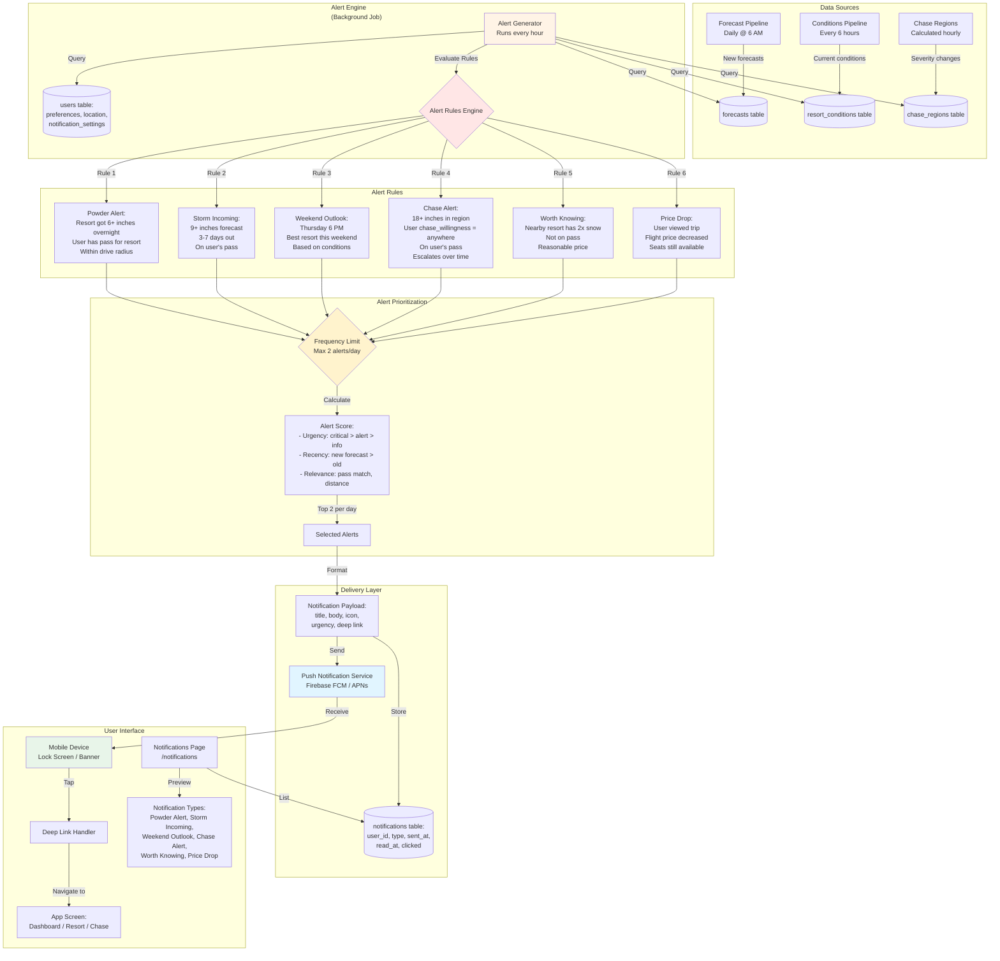

# OnlySnow Data Flow Diagrams

## 1. Chase Page Data Flow

### Overview
The Chase page shows national storm activity and allows users to drill into specific regions for resort-level detail.

```mermaid
graph TB
    subgraph "User Interface"
        A[Chase Page<br/>ApiChasePage.tsx] -->|User location| B[Geocode Service<br/>Open-Meteo API]
        A -->|National View| C[Region Cards Grid]
        A -->|Region Click| D[Region Detail View]
    end

    subgraph "Frontend Data Layer"
        E[Data Provider<br/>fetchChasePageData] -->|Filters: lat, lng, radiusMiles| F[API Client<br/>OnlySnowApiClient]
        G[Data Provider<br/>fetchRegionComparison] -->|regionId| F
    end

    subgraph "Backend API"
        H[GET /api/regions] -->|Cache Check| I[Redis Cache<br/>TTL: 1 hour]
        I -->|Cache Miss| J[Database Query]
        I -->|Cache Hit| K[Cached RegionSummary[]]
    end

    subgraph "Database Layer"
        J -->|1. Get all regions| L[(chase_regions table)]
        J -->|2. Get all resorts| M[(resorts table)]
        J -->|3. Get 5-day forecasts| N[(forecasts table)]

        L -->|region data| O[Region Metadata:<br/>name, slug, lat/lng,<br/>description]
        M -->|resort data| P[Resorts per Region:<br/>filter by chaseRegionId]
        N -->|WHERE date >= today<br/>AND date <= +5 days| Q[Sum snowfall<br/>GROUP BY resortId]
    end

    subgraph "Data Aggregation"
        O --> R[Aggregate per Region]
        P --> R
        Q --> R
        R -->|Calculate| S[totalSnowfall5Day<br/>bestResort<br/>resortCount]
        S -->|Classify| T[Severity:<br/>quiet/moderate/<br/>significant/chase]
        T -->|Based on snow total| U[RegionSummary Object]
    end

    subgraph "Frontend Processing"
        V[RegionSummary[]] -->|toChaseRegions| W[ChaseRegion[]]
        W -->|User location?| X{Has Location?}
        X -->|Yes| Y[Filter by radius<br/>600 miles default]
        X -->|No| Z[Show all regions]
        Y --> AA[Sort by:<br/>1. Severity<br/>2. Distance]
        Z --> AB[Sort by:<br/>Severity only]
    end

    subgraph "UI Rendering"
        C -->|For each region| AC[Region Card:<br/>severity badge, icon,<br/>forecast total, dates]
        AC -->|Click| AD[setSelectedRegion<br/>setView = region]
        AD --> AE[Fetch Region Comparison]
        AE --> AF[Resort Rankings:<br/>name, pass type,<br/>5-day snowfall,<br/>conditions, lifts]
    end

    B --> E
    E --> F
    F --> H
    H --> K
    K --> V
    V --> X
    AA --> C
    AB --> C
    AD --> G
    G --> F
    F --> AF

    style A fill:#e1f5ff
    style H fill:#fff4e6
    style L fill:#f0f0f0
    style M fill:#f0f0f0
    style N fill:#f0f0f0
    style T fill:#ffe6e6
    style AC fill:#e8f5e9
```

### Chase Page Data Flow Steps

#### National View Loading:
1. **User opens Chase page** → `ApiChasePage.tsx` mounts
2. **Get user location** → Geocode city name to lat/lng via Open-Meteo API
3. **Fetch regions** → `fetchChasePageData({ lat, lng, radiusMiles: 600 })`
4. **API Client call** → `GET /api/regions`
5. **Backend checks cache** → Redis key: `onlysnow:regions:all` (TTL: 1 hour)
6. **If cache miss:**
   - Query `chase_regions` table for all regions
   - Query `resorts` table for all resorts
   - Query `forecasts` table for 5-day snowfall sums (grouped by resort)
   - **Aggregate per region:**
     - Calculate `totalSnowfall5Day` (sum of all resort forecasts)
     - Find `bestResort` (resort with highest 5-day snowfall)
     - Count `resortCount`
     - Classify `severity` based on total snowfall:
       - `chase`: > 30" total
       - `significant`: 20-30" total
       - `moderate`: 10-20" total
       - `quiet`: < 10" total
   - Return `RegionSummary[]` and cache it
7. **Frontend adapts data** → `toChaseRegions()` converts to frontend types
8. **Filter & sort:**
   - If user location provided: filter to regions within 600 miles
   - Sort by: severity (chase → significant → moderate → quiet), then distance
9. **Render region cards** → Grid of clickable cards showing severity, forecast, dates

#### Region Detail View:
1. **User clicks region card** → `setView("region")`, `setSelectedRegion(region)`
2. **Fetch resort comparison** → `fetchRegionComparison(regionId)`
3. **API call** → `GET /api/regions/${regionId}/comparison` (not yet implemented in backend)
4. **Backend queries:**
   - Get all resorts in region (filter by `chaseRegionId`)
   - Get current conditions for each resort
   - Get 5-day forecast for each resort
   - Sort by 5-day snowfall (highest first)
5. **Render resort rankings** → List with medals (🥇🥈🥉), pass badges, conditions

---

## 2. Alerts & Notifications Data Flow

### Overview
Notifications are triggered by significant snow events, storm changes, or user-specific conditions.



### Alert Types & Triggers

#### 1. Powder Alert ❄️
**Trigger:** Resort got 6+ inches overnight
**Conditions:**
- User has pass for resort OR resort is independent
- Resort is within user's drive radius
- Sent at 6:30 AM
- Only on actual powder days (not forecasts)

**Example:**
> **Vail got 8" overnight ❄️**
> Back Bowls are loaded. Leave by 6:30am — garage fills by 8:30. Your best day this month.

---

#### 2. Storm Incoming 🌨️
**Trigger:** 9+ inches forecast in 3-7 days
**Conditions:**
- Resort is on user's pass
- Within drive radius
- Forecast confidence > 70%
- Sent when forecast first appears

**Example:**
> **9-12" hitting Vail Tuesday**
> NW flow storm arrives mid-week. Vail and Beaver Creek in the bullseye. Best day: Wednesday Feb 12.

---

#### 3. Weekend Outlook 📋
**Trigger:** Thursday 6 PM, every week
**Conditions:**
- Always sent (only weekly notification)
- Shows best resort for upcoming weekend
- Based on conditions + forecast
- Includes alternatives

**Example:**
> **This weekend: Breck is your best bet 🟡**
> Groomed conditions across the board. Breck has the most terrain open (64%). No new snow expected. Keystone has night skiing Fri-Sat.

---

#### 4. Chase Alert ✈️🔴
**Trigger:** 18+ inches forecast in chase-worthy region
**Conditions:**
- User `chase_willingness = "anywhere"` OR `"driving"`
- Resort is on user's pass
- Region is within chase radius (anywhere = national, driving = 10 hrs)
- **Escalation timeline:**
  - **7-10 days out:** 📡 Heads up (forecast showing potential)
  - **5-6 days out:** 🎯 Firming up (check flight prices)
  - **3-4 days out:** 🔴 Book now (go/no-go moment)
  - **1-2 days out:** ❄️ Storm arriving

**Example:**
> **🔴 Telluride: 18-24" next week**
> On your Ikon pass. EWR→MTJ $289 RT. This is chase-worthy. Book today — flights will sell out once forecast firms up Sunday.

---

#### 5. Worth Knowing 💡
**Trigger:** Nearby resort has 2x the snow of pass resorts
**Conditions:**
- Resort is NOT on user's pass
- Within drive radius
- Walk-up ticket price < $120
- Snow total is significantly better

**Example:**
> **Loveland got 6" — 2x your resorts**
> Not on your pass, but $89 walk-up and 15 min closer than Breck. Best snow on I-70 today.

---

#### 6. Price Drop 💰
**Trigger:** Flight price decreased for viewed chase trip
**Conditions:**
- User viewed trip estimate in last 7 days
- Flight price dropped > $30
- Seats still available
- Storm forecast still valid

**Example:**
> **MTJ flights dropped to $249 ✈️**
> You viewed the Telluride chase trip yesterday. Flights to Montrose just dropped $40. Still 3 seats left.

---

### Alert Rules & Constraints

**Hard Limits:**
- **Max 2 alerts per day** (never more)
- **Never send on uneventful days** (no snow = no alerts)
- **Weekend outlook:** Exactly once per week (Thursday 6 PM)
- **Chase alerts escalate** over time (4 stages as storm approaches)

**Scoring Algorithm:**
```javascript
function calculateAlertScore(alert, user) {
  let score = 0;

  // Urgency weight
  if (alert.urgency === 'critical') score += 100;
  else if (alert.urgency === 'alert') score += 50;
  else if (alert.urgency === 'info') score += 10;

  // Recency weight (newer forecasts score higher)
  const hoursSinceUpdate = (Date.now() - alert.forecastUpdatedAt) / 3600000;
  score += Math.max(0, 50 - hoursSinceUpdate);

  // Relevance weight
  if (alert.passMatch) score += 30; // On user's pass
  if (alert.distanceMiles < user.driveRadius) score += 20; // Within drive range
  if (alert.type === 'powder' && alert.snowfall >= 12) score += 40; // Deep powder

  // Personalization weight
  if (user.persona === 'powder-hunter' && alert.type === 'powder') score += 25;
  if (user.persona === 'storm-chaser' && alert.type === 'chase') score += 25;

  return score;
}
```

**Selection Process:**
1. Generate all possible alerts for user
2. Calculate score for each alert
3. Sort by score (highest first)
4. Select top 2 that haven't been sent today
5. Send notifications
6. Log to `notifications` table with `sent_at` timestamp

---

## 3. Database Schema for Alerts

```sql
-- Notifications table
CREATE TABLE notifications (
  id SERIAL PRIMARY KEY,
  user_id INTEGER NOT NULL REFERENCES users(id),
  type TEXT NOT NULL, -- 'powder', 'storm', 'weekend', 'chase', 'worth_knowing', 'price_drop'
  urgency TEXT NOT NULL, -- 'info', 'alert', 'critical'
  title TEXT NOT NULL,
  body TEXT NOT NULL,
  icon TEXT,
  deep_link TEXT, -- URL to navigate to in app
  metadata JSONB, -- Additional data (resort_id, region_id, flight_price, etc.)
  sent_at TIMESTAMP WITH TIME ZONE NOT NULL DEFAULT NOW(),
  read_at TIMESTAMP WITH TIME ZONE,
  clicked_at TIMESTAMP WITH TIME ZONE,
  dismissed_at TIMESTAMP WITH TIME ZONE,
  created_at TIMESTAMP WITH TIME ZONE NOT NULL DEFAULT NOW()
);

-- User notification preferences
CREATE TABLE user_notification_settings (
  user_id INTEGER PRIMARY KEY REFERENCES users(id),
  powder_alerts BOOLEAN DEFAULT TRUE,
  storm_alerts BOOLEAN DEFAULT TRUE,
  weekend_outlook BOOLEAN DEFAULT TRUE,
  chase_alerts BOOLEAN DEFAULT FALSE, -- Opt-in for destination travelers
  worth_knowing BOOLEAN DEFAULT TRUE,
  price_alerts BOOLEAN DEFAULT TRUE,
  quiet_hours_start TIME, -- e.g., 22:00 (10 PM)
  quiet_hours_end TIME, -- e.g., 07:00 (7 AM)
  updated_at TIMESTAMP WITH TIME ZONE NOT NULL DEFAULT NOW()
);

-- Viewed trips (for price drop alerts)
CREATE TABLE viewed_trips (
  id SERIAL PRIMARY KEY,
  user_id INTEGER NOT NULL REFERENCES users(id),
  region_id INTEGER NOT NULL REFERENCES chase_regions(id),
  flight_price DECIMAL(10, 2),
  flight_origin TEXT,
  flight_destination TEXT,
  trip_dates JSONB, -- {start: '2026-02-15', end: '2026-02-18'}
  viewed_at TIMESTAMP WITH TIME ZONE NOT NULL DEFAULT NOW()
);
```

---

## 4. Implementation Notes

### Chase Page:
- ✅ **Implemented:** National view with region cards, severity classification, proximity filtering
- ✅ **Implemented:** Region detail view with resort comparison
- ⏳ **TODO:** Backend endpoint for region comparison (`GET /api/regions/:id/comparison`)
- ⏳ **TODO:** Real-time severity updates (currently cached for 1 hour)
- ⏳ **TODO:** Map view of regions (similar to resort map)

### Alerts/Notifications:
- 📋 **Planned:** Background job to generate alerts (cron or queue-based)
- 📋 **Planned:** Alert rules engine with scoring algorithm
- 📋 **Planned:** Push notification integration (Firebase FCM)
- 📋 **Planned:** Database schema for notifications and user preferences
- 📋 **Planned:** In-app notifications page (currently just mockups)
- 📋 **Planned:** Escalation timeline for chase alerts
- 📋 **Planned:** Price tracking integration for flight alerts

---

## 5. Data Freshness & Caching Strategy

### Forecast Data:
- **Source:** NOAA/OpenWeather API
- **Update Frequency:** Daily at 6 AM MT
- **Cache TTL:** 6 hours (Redis)
- **Stale-while-revalidate:** 1 hour

### Conditions Data:
- **Source:** Resort websites / third-party APIs
- **Update Frequency:** Every 6 hours
- **Cache TTL:** 1 hour (Redis)
- **Stale-while-revalidate:** 30 minutes

### Chase Regions:
- **Calculated from:** Forecasts aggregated by region
- **Update Frequency:** Hourly (on forecast update)
- **Cache TTL:** 1 hour (Redis)
- **Stale-while-revalidate:** 30 minutes

### Alerts:
- **Generated:** Every hour (background job)
- **Delivery:** Immediate via push notification service
- **Storage:** Persisted in `notifications` table
- **Retention:** 30 days for history, unlimited for read receipts

---

## 6. Performance Considerations

### Chase Page:
- **Parallel queries:** Fetch regions and forecasts concurrently
- **Proximity filtering:** Use Haversine distance calculation in-memory (fast for < 100 regions)
- **Severity classification:** Pre-computed during region aggregation
- **Response time target:** < 500ms for national view, < 300ms for region detail

### Alerts:
- **Background processing:** Run alert generation as async job (not on request path)
- **Batch processing:** Generate alerts for all users in batches (1000 users/batch)
- **Rate limiting:** Max 2 notifications per user per day
- **Deduplication:** Check `notifications` table to avoid sending duplicates
- **Queue:** Use Redis queue or SQS for notification delivery

---

*Last updated: February 8, 2026*
